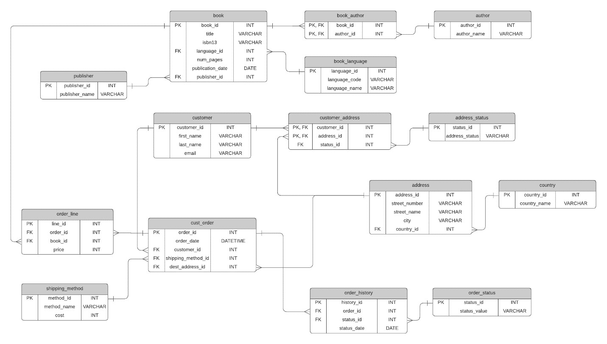
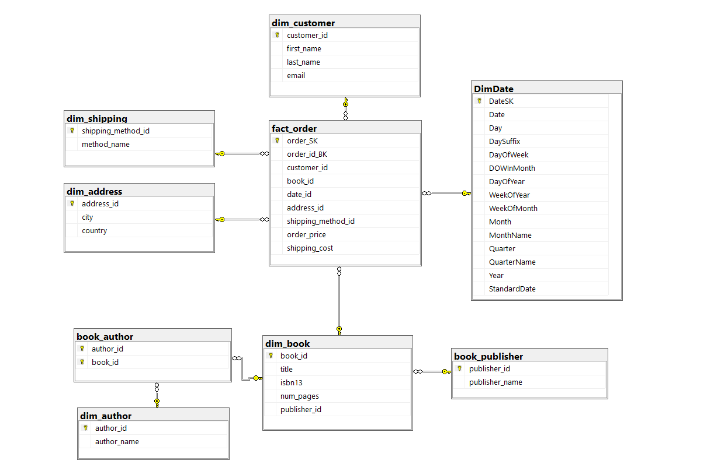
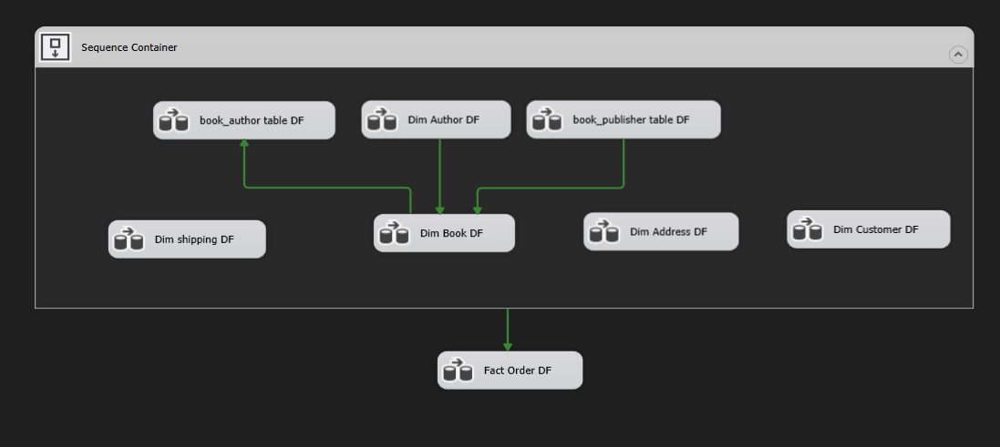
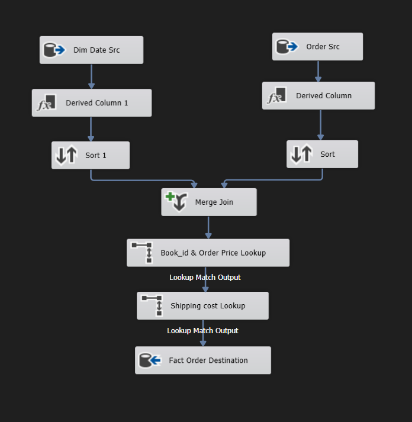
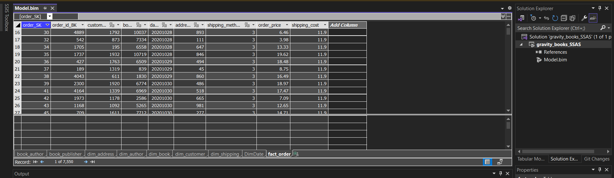
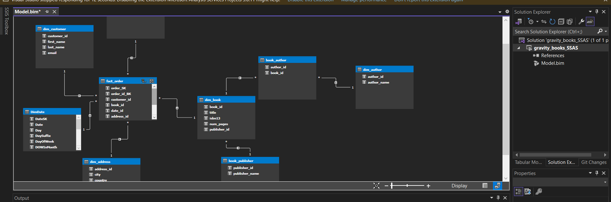
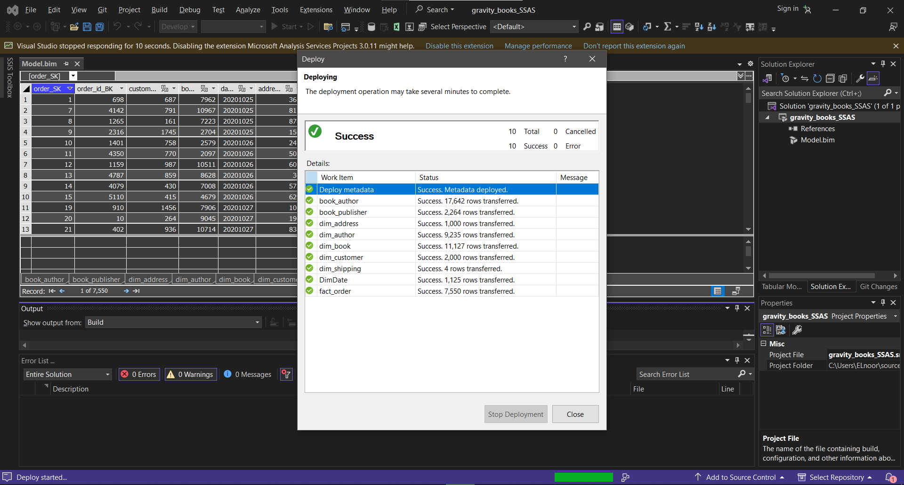
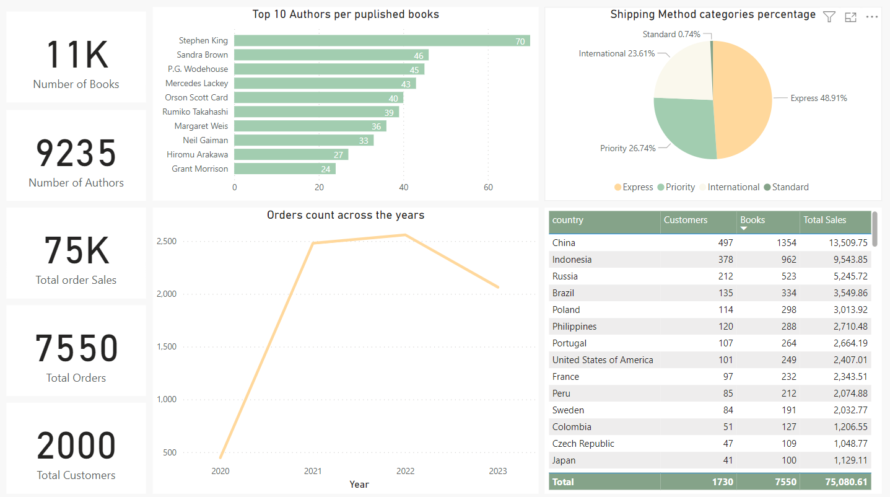

# Gravity Bookstore Data Project
Data Warehousing, Analysis, and Dashboard Integration for Gravity Bookstore.

## Project Description
Gravity Bookstore is a database for a fictional bookstore called that captures information about books, customers, and sales.

The project includes: 
- Build a data warehouse for Gravity Bookstore to capture information about books, customers, and orders. 
- Create data cubes for analyzing orders and customer data. 
- Develop a dashboard for easy access and visualization of key business metrics.

 
The project began by constructing a data warehouse with SQL Server and using SQL Server Integration Services (SSIS) for systematic data collection, organizing information on books, customers, and sales. Next, data cubes were developed with SQL Server Analysis Services (SSAS) in tabular mode, enabling detailed analysis of order trends and customer behavior. Finally, a user-friendly Power BI dashboard was created, integrating insights from the data warehouse and cubes for easy tracking and improvement of business performance.

## Data Source

>The below link provides the data  
>https://github.com/bbrumm/databasestar/tree/main/sample_databases/sample_db_gravity/gravity_sqlserver

## Building Data Warehouse
In the context of the Gravity Bookstore database, a snowflake schema approach is more suitable due to its normalization of data, which can be beneficial for complex data structures and reporting requirements.

The database has a complex structure with many related tables, including many-to-many relationships. A snowflake schema allows for a higher level of normalization, which can help in reducing data redundancy and ensuring data consistency.  

## ETL using SSIS
To populate the warehouse with data, SQL Server Integration Services (SSIS) was employed for Extract, Transform, Load (ETL) processes. This ensured that information about books, customers, and sales was systematically collected and organized within the data warehouse.

#### Control Flow

#### Fact Table

## Data Cube Creation - SSAS
The next step involved the development of data cubes, a critical component for in-depth analysis of sales and customer data. To accomplish this, SQL Server Analysis Services (SSAS) was employed, specifically in the tabular mode. The data cubes were meticulously designed to facilitate multidimensional analysis, enabling detailed insights into sales trends, customer behavior, and other key metrics. This step allowed for efficient querying and analysis of data.

## Dashboard with Power BI

